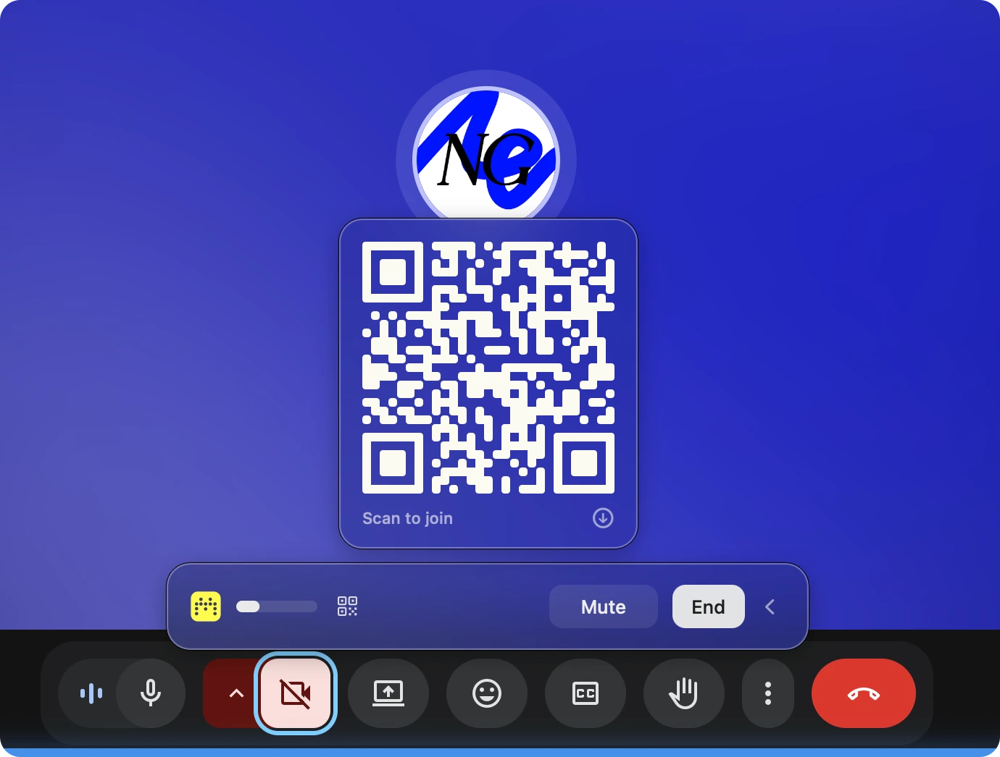
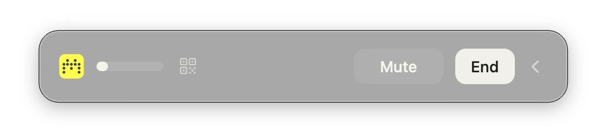
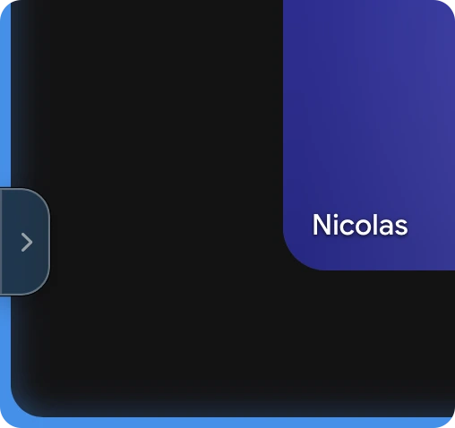
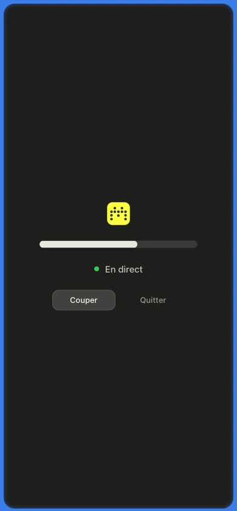

<p align="center">
  
</p>

<h1 align="center">Micara</h1>

## Install
The command bellow builds the app, puts it in `/Applications` and starts it.
Needs macOS 13+ and the Xcode command line tools (`xcode-select --install`).
Your password is asked once, to install **BlackHole**, the virtual microphone
Micara writes into: a system driver, and no app can put one in place without
it.

No window, no Dock icon. Look for the Micara logo in the menu bar.

```sh
git clone https://github.com/GNRNicolas/micara-mac.git && cd micara-mac && ./build.sh --install
```

The phones in the room become the microphones of your Teams, Zoom or Meet
meeting. Micara lives in the Mac menu bar; during a meeting a blue border
surrounds the screen and a small bar at the bottom shows the sound going
through.




## Use

1. Menu → **Start a Meeting**. Blue border, bar, and **Micara** becomes the
   default microphone until the meeting ends.
2. Pick the **Micara** microphone in Teams, Zoom or Meet (Chrome calls it
   "Micara (Aggregate)").
3. Hover the QR icon, participants scan it with their phone and allow the
   microphone. One green dot per phone.
4. **Mute** cuts every phone at once; the Mac's mic keeps going. **End** closes
   the meeting.



The chevron tucks the bar away at the left edge of the screen; a tab brings it
back.



The QR panel's download button writes a print card into `~/Downloads`, for the
meeting-room wall. The space code never changes, so the card stays valid. No
account, no password.

<p align="center">
  
</p>

On the phone, nothing to install: a web page asks for the microphone and shows
a level meter and a Mute button. Audio goes directly to the Mac over WebRTC;
the server only introduces the two.

## Mixing

| Mode | Behaviour |
|---|---|
| Dominance + gate (default) | The loudest source speaks, the others are ducked by 18 dB. A gate mutes the phones that only hear the room. |
| Sum | Everything added together, with a limiter. |

## Permissions

**Microphone**, at the first meeting. Nothing else. The app is signed locally
on every install, so macOS asks again after an update.

## Updates

One anonymous request a day to the GitHub releases page. When a new version is
out, **Update** re-runs `git pull && ./build.sh --install` and restarts the
app. Turn the check off with **Check for Updates Automatically**.

## Troubleshooting

- The Micara microphone carries sound only during a meeting; the "Micara"
  speaker is silent by design.
- Log: `~/Library/Logs/micara.log`.
- Menu → **Reinstall the Micara Microphone** if it vanished from the audio
  settings.

[SPECS.md](SPECS.md) covers the architecture and the decisions behind it.

## Licenses

Micara: [MIT](LICENSE). BlackHole (Existential Audio): GPL-3.0, installer
bundled as is. LiveKit WebRTC: BSD.
