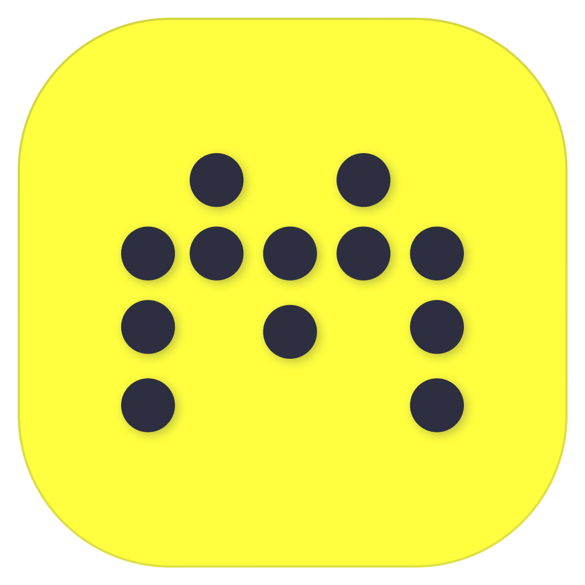

<p align="center">
  
</p>

<h1 align="center">Micara</h1>

The phones in the room become the microphones of your Teams, Zoom or Meet
meeting. Micara lives in the Mac menu bar; during a meeting a blue border
surrounds the screen and a small bar at the bottom shows the sound going
through.

## Install

```sh
git clone https://github.com/GNRNicolas/micara-mac.git && cd micara-mac && ./build.sh --install
```

That builds the app, puts it in `/Applications` and starts it. Needs macOS 13+
and the Xcode command line tools (`xcode-select --install`). Once, it asks for
your password: that is to install **BlackHole**, the virtual microphone Micara
writes into. A virtual microphone is a system driver, and no app can put one in
place without it.

Micara then opens when the Mac starts, with no window and no Dock icon. Look
for the microphone in the menu bar, near the clock.

## Use

1. In Teams, Zoom or Meet, pick the **Micara** microphone. Micara also sets it
   as the Mac's default microphone for the duration of the meeting, and puts
   the previous one back at the end.
2. Micara menu → **Start a Meeting**. The blue border appears, the bar slides
   up.
3. Hover the QR icon in the bar: the QR code unfolds (click it to keep it open). Each participant scans it with their
   phone, allows the microphone, and that is it. One green dot per connected
   phone; orange if it drops, and it disappears if it does not come back.
4. **Mute Phones** mutes every phone at once, the Mac's microphone keeps going.
   **End the Meeting** closes it.

The space code is assigned at install time and never changes: the QR is the
same at every meeting. No account, no password.

## Mixing

Menu → **Mixing**:

| Mode | Behaviour |
|---|---|
| Dominance + gate (default) | The loudest phone speaks, the others are ducked by 18 dB. A noise gate mutes the phones lying on the table that only hear the room. |
| Sum | Every stream added together, with a limiter to avoid clipping. |

The Mac's microphone is always in the mix. Echo cancellation is left to Teams/Zoom: macOS only offers its own on the default input, which is Micara itself during a meeting.

## Permissions

**Microphone**, asked at the first meeting: Micara captures the Mac's
microphone to mix it with the phones. Nothing else. The app is signed locally
on every install, so macOS asks for that permission again after an update.

## Updates

One anonymous request a day to GitHub. When a new version is out, Micara says
so; **Update** re-runs `git pull && ./build.sh --install` and restarts the app.

## Troubleshooting

- Log: `~/Library/Logs/micara.log`.
- The "Micara" microphone has vanished from the audio settings: menu →
  **Reinstall the Micara Microphone**.
- `kill -USR1 $(pgrep -x Micara)` starts or ends a meeting without the menu.

[SPECS.md](SPECS.md) covers the architecture and the decisions behind it.

## Licenses

Micara: MIT. BlackHole (Existential Audio): GPL-3.0, installer bundled as is,
license text inside the app. LiveKit WebRTC: BSD.
