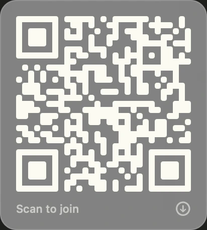
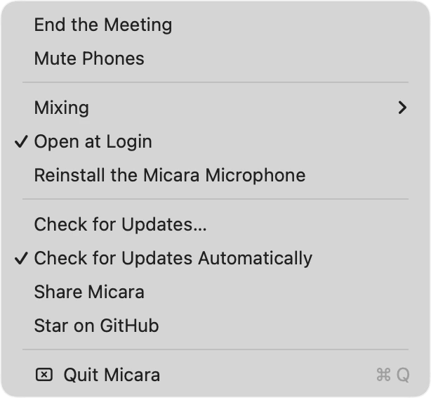

<p align="center">
  
</p>

<h1 align="center">Micara</h1>

The phones in the room become the microphones of your Teams, Zoom or Meet
meeting. Micara lives in the Mac menu bar; during a meeting a blue border
surrounds the screen and a small bar at the bottom shows the sound going
through.


## Install

```sh
git clone https://github.com/GNRNicolas/micara-mac.git && cd micara-mac && ./build.sh --install
```

That builds the app, puts it in `/Applications` and starts it. Needs macOS 13+
and the Xcode command line tools (`xcode-select --install`). Once, it asks for
your password: that is to install **BlackHole**, the virtual microphone Micara
writes into. A virtual microphone is a system driver, and no app can put one in
place without it.

Micara then opens when the Mac starts, with no window and no Dock icon. Look
for the Micara logo in the menu bar, near the clock.

## Use

1. Menu → **Start a Meeting**. The blue border appears, the bar slides up, and
   **Micara** becomes the Mac's default microphone for the duration of the
   meeting (the previous one comes back at the end).
2. In Teams, Zoom or Meet, pick the **Micara** microphone (Chrome lists it as
   "Micara (Aggregate)").
3. Hover the QR icon in the bar: the QR code unfolds; click it to keep it open.
   Each participant scans it with their phone, allows the microphone, and that
   is it. One green dot per connected phone; orange if it drops, gone if it does
   not come back.
4. **Mute** cuts every phone at once, the Mac's microphone keeps going.
   **End** closes the meeting. The chevron collapses the bar to the left edge
   of the screen when it is in the way.


The QR panel has a download button: it writes a print card into `~/Downloads`,
to stick on the meeting-room wall. The space code is assigned at install time
and never changes, so the card stays valid. No account, no password.

<p align="center">
  
  &nbsp;&nbsp;&nbsp;
  
</p>

On the phone there is nothing to install: a web page opens, asks for the
microphone, and shows a level meter and a Mute button. The phone's audio goes
**directly to the Mac** over WebRTC (the server only introduces the two); the
Mac mixes it with its own microphone and hands the result to the meeting.

## Mixing

Menu → **Mixing**:

| Mode | Behaviour |
|---|---|
| Dominance + gate (default) | The loudest source speaks, the others are ducked by 18 dB. A noise gate mutes the phones lying on the table that only hear the room. |
| Sum | Every stream added together, with a limiter to avoid clipping. |

The Mac's microphone is always in the mix. Echo cancellation is left to
Teams/Zoom: macOS only offers its own on the default input, which is Micara
itself during a meeting.

## Permissions

**Microphone**, asked at the first meeting: Micara captures the Mac's
microphone to mix it with the phones. Nothing else: no Accessibility, no Screen
Recording, no login. The app is signed locally on every install, so macOS asks
for that permission again after an update.

The "Micara" microphone the meeting apps see is a CoreAudio *aggregate device*
wrapping BlackHole 16ch. An aggregate lives in the user's own audio settings,
so Micara can create, repair and remove it without any privilege; only the
BlackHole driver itself needs the one-time password at install.

## Menu



| Item | What it does |
|---|---|
| Start / End the Meeting | The whole cycle: microphone, border, bar, phones. |
| Mute Phones | Same as the bar's Mute. The Mac's mic is never muted from here. |
| Mixing | Dominance + gate, or Sum. Changeable mid-meeting. |
| Open at Login | via `SMAppService`, on by default. |
| Reinstall the Micara Microphone | Recreates the aggregate if it vanished from the audio settings. |
| Check for Updates… / Automatically | See below. |

## Updates

One anonymous request a day to the GitHub releases page. When a new version is
out, Micara says so; **Update** re-runs `git pull && ./build.sh --install` in
the folder you cloned and restarts the app. Nothing is sent about you. Turn the
daily check off with **Check for Updates Automatically**.

## Troubleshooting

- The microphone carries sound only while a meeting is running: outside one, a
  mic test in Meet shows nothing, which is expected. Likewise the "Micara"
  *speaker* is silent by design: keep your usual speakers selected.
- Log: `~/Library/Logs/micara.log`.
- `kill -USR1 $(pgrep -x Micara)` starts or ends a meeting without the menu.

[SPECS.md](SPECS.md) covers the architecture and the decisions behind it.

## Licenses

Micara: [MIT](LICENSE). BlackHole (Existential Audio): GPL-3.0, installer
bundled as is, license text inside the app. LiveKit WebRTC: BSD.
